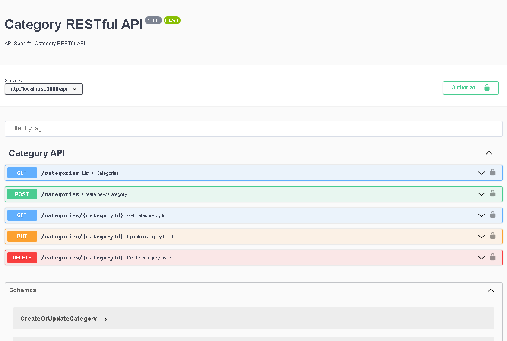

# Category rest-api
Restful api go-lang

## Technology Stack
- Golang 
- MySQL


**Restful-API Preview**



## Quickstart


This deployment method will run the application in an existing localhost.

Pre-requisites:
- go installed locally
- mysql server installed


Setup repository go for localhost :
```
go mod tidy
```

DB setup for postgres:

- Create database 'golang_restful_api':
- restore db from ./dump/golang_restful_api_category.sql


Run command

```
go run main.go
```

Collection postman can be import from directory ./postman/


